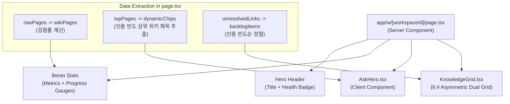

# 대시보드 메인 섹션 고도화 설계 및 구현 계획서
**문서 위치:** `docs/design-systems/dashboard-redesign-plan.md`  
**디자인 기준:** leonxlnx (Anti-Slop Taste-Skill) & Editorial Knowledge Workspace  
**최종 업데이트:** 2026-09-01

---

**구현 전 게이트.** 이 문서는 디자인 계획서이며, 아직 OpenSpec change로 승격되지 않았다. `openspec/changes/`에는 archive만 있다. 홈 대시보드의 사용자 행동을 바꾸는 변경이므로, 구현 전에 `/plan-feature` → `/opsx:propose`를 거쳐야 한다.

---

## 1. 개요 및 배경 (Context & Motivation)

### 1.1 현 대시보드의 한계
현재 NexusWiki의 홈 대시보드(`apps/dashboard/app/w/[workspaceId]/page.tsx`)는 기능적으로 안정적이나, 시각적 감성과 사용자 경험 측면에서 다음 5가지 개선 과제를 안고 있습니다:

1. **시각적 앵커(Visual Anchor)의 부재:** "홈대시보드"라는 텍스트만 평면적으로 노출되어, 진입 시 워크스페이스의 정체성과 매력을 느끼기 어렵습니다.
2. **비맥락적 하드코딩:** 중앙 질문창(AskHero)의 추천 칩과 플레이스홀더가 특정 엔지니어링 용어("PostgreSQL RLS...")로 하드코딩되어 있어, 마케팅/비즈니스 등 다른 도메인의 워크스페이스에서 이질감을 줍니다.
3. **평면적인 4분할 통계:** 단순 보더 박스 안에 숫자만 나열되어 있어, 지식의 건강 상태(Health)나 완성도를 직관적으로 파악하기 어렵습니다.
4. **대칭 리스트의 시각적 피로:** 5:5 대칭 분할된 긴 목록에 단순 구분선만 그어져 있어 클릭 유도와 정보 탐색 효율이 낮습니다.
5. **정적인 뷰어에 머무는 백로그:** 작성 대기 백로그가 단순 빨간 텍스트로 나열되어 있어, '지식을 채워 넣는 작업 공간'으로서의 액션 유도가 부족합니다.

### 1.2 목표 (Design Objective)
Linear, Raycast, Craft 등의 감성을 차용한 **"세련되고 조용한 프리미엄 지식 커맨드 센터(Quiet Editorial Knowledge Command Center)"**를 구축합니다. 장식적인 군더더기(Slop)는 배제하고, 높은 정보 밀도와 우아한 위계 질서, 컨텍스트 기반의 동적 지능을 제공합니다.

---

## 2. 디자인 원칙 (Anti-Slop Design Principles)

1. **Context-Adaptive Intelligence (맥락 적응형 지능):**
   하드코딩된 UI를 제거하고, 현재 워크스페이스의 실제 원문 및 상위 위키 문서 데이터를 바탕으로 추천 질문과 상태를 동적으로 구성합니다.
2. **Layered Surface & Ambient Depth (서틀한 뎁스와 글로우):**
   유치한 원색 그라디언트 대신, `var(--surface)`, 은은한 앰비언트 글로우(Ambient Glow)와 1px 마이크로 보더로 세련된 입체감을 부여합니다.
3. **6:4 Asymmetric Hierarchy (비대칭 시선 집중):**
   좌측의 주력 콘텐츠(검증된 위키 60%)와 우측의 보조 액션(지식 공백 백로그 40%)으로 비대칭 분할하여 시선의 흐름을 자연스럽게 유도합니다.
4. **Actionable Knowledge Surface (액션 중심의 지식 표면):**
   단순 상태 조회를 넘어 백로그에 `[소스 추가]` 인라인 액션 버튼을 제공하여 워크스페이스의 생산성을 극대화합니다.

---

## 3. 섹션별 상세 설계 명세 (Detailed Specifications)

### 3.1 브랜드 히어로 헤더 (Brand Hero Header)
* **구성:**
  * **타이틀:** 고정 페이지 제목 `"홈 대시보드"` (`font-extrabold text-2xl sm:text-3xl`)
    * `h1`은 `"홈 대시보드"`를 유지한다. 워크스페이스명을 `h1`에 넣지 않으며, `workspaces` 조회를 새로 추가하지 않는다.
    * LNB의 `WorkspaceSwitcher`가 이미 워크스페이스명을 노출하므로, `h1`에 같은 이름을 두면 화면 내 명칭이 중복된다.
  * **지식 완결도 뱃지:** 검증 완료율을 표시한다 (`지식 완결도 {rate}%`). realtime 구독은 없으며, `formatTimeAgo(latestUpdated)`는 서버 렌더 시점의 스냅샷이므로 "라이브" 펄스 뱃지는 쓰지 않는다.
  * **서브타이틀:** 수집된 원문 개수와 컴파일된 위키 문서 수를 문장으로 조합한 맞춤형 안내 문구
* **계약:** 기존 브레드크럼 및 상단 액션 바와의 위계 일관성 유지.

### 3.2 Command-K AI Ask 센터 (`AskHero.tsx`)
* **비주얼 인터랙션:**
  * 포커스 시 부드럽게 살아나는 앰비언트 글로우 백그라운드 (`opacity-60 → 100`)
  * 좌측 상단 반짝임 아이콘 배지 및 미려한 텍스트에어리어
  * 우측 하단 `[AI 질문하기 ↗]` 액션 버튼. `⌘ + Enter` 제출은 `AskHero.tsx`의 `handleKeyDown`에 이미 구현되어 있다. 단축키 힌트 뱃지는 신설하지 않는다.
* **동적 칩(Dynamic Chips) 시스템:**
  * 상위 컴포넌트로부터 `defaultChips` props를 전달받아 렌더링.
  * 워크스페이스 내 인용 빈도가 높은 상위 3~4개 위키 문서 제목을 자동으로 추출하여 추천. 인용 빈도는 `wiki_pages.sources` 배열 길이다. 조회수 컬럼은 스키마에 없다.
  * 칩 클릭 시 질문 입력창에 텍스트가 채워지고 포커스가 이동하는 마이크로 인터랙션.

### 3.3 벤토 스마트 메트릭 카드 (`BentoStats`)
* **레이아웃:** 4열 벤토 그리드 (`grid-cols-2 lg:grid-cols-4 gap-3.5`)
* **개별 카드 스펙:**
  1. **컴파일된 위키:** 총 문서 수 + 검증률 뱃지(`검증률 93%`) + 미니 프로그레스 바
  2. **연결된 원문 소스:** 총 원문 수 + 인덱싱된 청크 수 뱃지 + 완료 상태 바. 홈 `page.tsx`에 `source_chunks` 카운트 쿼리 추가 필요 — `apps/dashboard/app/w/[workspaceId]/sources/page.tsx:56`의 기존 패턴 재사용.
  3. **작성 대기 지식 공백:** 미완성 백로그 수 + 주의 뱃지(`보완 권장`) + 앰버 프로그레스 바
  4. **최종 업데이트:** 상대 시간(예: `34분 전`). 서버 렌더 시점 스냅샷이며 실시간 동기화 상태 배지는 두지 않는다.

### 3.4 듀얼 지식 그리드 (`KnowledgeGrid.tsx`)
* **레이아웃:** 데스크톱 기준 `grid-cols-[1.4fr_1fr]` (약 6:4 비율)
* **좌측: 검증된 위키 문서 (Verified Wiki Library)**
  * 카드형 아이템 (`wiki-card`):
    * 상단: 카테고리 태그(`[개념]`, `[엔티티]`, `[가이드]`, `[맵]`) + 검증 아이콘(`검증됨`) + 인용 원문 수(`인용 N개`). 라벨은 `KnowledgeGrid.tsx`의 `CATEGORY_LABELS`와 같다 (`concepts:개념, entities:엔티티, guides:가이드, maps:맵`).
    * 중앙: 문서 제목 (호버 시 액센트 컬러 전환)
    * 우측: 서틀한 체브론 아이콘 (호버 시 `translateX(2px)` 모션)
* **우측: 지식 공백 백로그 (Knowledge Gaps & Backlog)**
  * 카드형 아이템 (`gap-card`):
    * 좌측 3px 앰버 보더(`border-left: 3px solid var(--warning)`)로 시각적 주목도 부여
    * 제목 및 참조 메타데이터(`위키 N곳에서 참조 중 · 원문 소스 연결 필요`)
    * 우측 인라인 액션 버튼: `[소스 추가]`. 초안 생성 기능은 코드베이스에 없다. 백로그의 실제 액션은 `/sources?prefillTitle=...&tab=text` 프리필 링크이며, `BacklogList.tsx`와 `BacklogDetailModal.tsx`가 이미 이 패턴을 쓴다.
    * 결정 기록: 버튼 라벨은 기존 제품 카피와 일관되게 `소스 추가`를 유지한다. 계획서가 제안했던 `[원문 수집]`은 채택하지 않는다.

---

## 4. 컴포넌트 아키텍처 및 데이터 흐름

---

## 5. CSS 디자인 토큰 매핑 가이드

이 앱은 단일 테마다. `docs/design-systems/v2/nexuswiki-design-system.css`의 `:root`가 유일한 팔레트이며, `prefers-color-scheme` 규칙과 `apps/dashboard`의 Tailwind `dark:` 변형은 없다. 아래 토큰명과 값은 그 파일의 `:root`에서 그대로 옮긴 것이다. hex를 새로 도입하지 않는다.

| 역할 | 토큰 | `:root` 값 | 적용 위치 |
| :--- | :--- | :--- | :--- |
| **캔버스 배경** | `--bg` | `oklch(1 0 0)` | 메인 페이지 배경 |
| **카드 표면** | `--surface` | `oklch(.982 .004 247)` | 벤토 카드, 위키 카드 배경 |
| **은은한 채움** | `--soft` | `oklch(.965 .025 190)` | 배지 배경, 활성 LNB |
| **강조 채움** | `--soft-strong` | `oklch(.94 .025 190)` | 선택 행, 활성 청크 |
| **테두리 선** | `--border` | `oklch(.928 .012 255)` | 카드 및 인풋 외곽선 |
| **테두리 강조** | `--border-strong` | `oklch(.80 .015 255)` | 호버 시 테두리 |
| **기본 텍스트** | `--fg` | `oklch(.208 .033 264)` | 제목 및 주요 헤드라인 |
| **보조 텍스트** | `--muted` | `oklch(.554 .033 258)` | 메타데이터, 설명 문구 |
| **브랜드 액센트** | `--accent` | `oklch(.58 .11 190)` | 버튼, 프로그레스, 글로우 |
| **액센트 프레스** | `--accent-active` | `oklch(.49 .11 190)` | primary 버튼 호버/프레스 |
| **검증·정상** | `--good` | `oklch(.63 .14 155)` | 검증률 뱃지, 완료 상태 |
| **삭제·실패** | `--danger` | `oklch(.57 .205 20)` | 위험 액션 |
| **경고·주의** | `--warning` | 신규 추가 예정 (`:root`에 아직 없음) | 백로그 좌측 보더, 이후 경고·주의 상태 |

### 결정 기록 — 백로그 앰버 보더

§3.4 백로그 카드의 좌측 앰버 보더는 v2 `:root`의 `--warning` 토큰을 쓴다. 레거시 `docs/design-systems/design-tokens.css`의 `--color-warning-text`는 재사용하지 않는다. 백로그 보더 한 곳이 아니라 앞으로의 경고·주의 상태 전반에서 표준으로 재사용하기 위해서다. 값은 아직 `:root`에 없으므로 구현 시 토큰을 새로 판다.

---

## 6. 단계별 구현 로드맵 (Execution Roadmap)

### Phase 1: 기반 데이터 연동 및 헤더/통계/Ask 개편
- `app/w/[workspaceId]/page.tsx`에서 검증률(`verifiedRate`) 및 상위 3개 추천 칩(`dynamicChips`) 산출 로직 작성. 칩은 인용 빈도(`wiki_pages.sources` 배열 길이) 기준이다.
- 히어로 헤더에 `지식 완결도 뱃지` 적용 및 4분할 벤토 메트릭 그리드 마크업 개선. 벤토 2번 카드의 청크 수는 홈 `page.tsx`에 `source_chunks` 카운트 쿼리를 추가해 채운다.
- `components/AskHero.tsx`의 래퍼에 앰비언트 글로우 효과 및 모던 인풋 레이아웃 적용.
- 하드코딩된 `DEFAULT_CHIPS` 대신 상위에서 주입된 동적 추천 칩 렌더링.

### Phase 2: 6:4 듀얼 지식 그리드 리팩토링
- `components/KnowledgeGrid.tsx`의 그리드 레이아웃을 `grid-cols-[1.4fr_1fr]` 비대칭으로 재구성.
- 좌측 위키 문서 행을 입체적인 호버 카드로 업그레이드 (카테고리/검증/인용 뱃지 통합).
- 우측 지식 백로그 행에 `--warning` 보더 및 `[소스 추가]` 액션 버튼 연동 (`/sources?prefillTitle=...&tab=text`).

### Phase 3: 테스트 스위트 및 디자인 검증
- **수정 대상 테스트** (현재 계획대로면 실패가 확정이다):
  - `apps/dashboard/tests/AskHero.test.tsx:37` — 하드코딩 칩 문자열 `"PostgreSQL RLS 격리 규칙 요약"`을 직접 단언한다. `DEFAULT_CHIPS` 제거와 충돌한다.
- `tests/AskHero.test.tsx`, `tests/KnowledgeGrid.test.tsx`, `tests/workspace-home.test.tsx`를 위 단언에 맞게 고친 뒤 실행한다.
- `pnpm test`, `pnpm typecheck`, `pnpm lint` 통과 확인.

---

## 7. 프로토타입에 관하여

이 설계는 로컬 HTML 프로토타입으로 먼저 탐색했으나, 그 프로토타입은 **저장소에 커밋하지 않는다.**

- `apps/dashboard/public/` 아래에 두면 인증 없이 서비스되는 URL이 된다.
- 프로토타입은 `<html class="dark">` 기반이라, 이 문서 §5가 확정한 단일 테마와 반대 방향이다.

설계의 정본은 이 문서와 `openspec/specs/workspace-home-dashboard/spec.md`이며, 동작하는 기준은 구현된 홈 화면이다.
